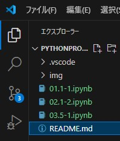

東京大学 数理・情報教育研究センターの[Pythonプログラミング入門](https://utokyo-ipp.github.io/)を使わせていただきます。

[ライセンス](https://github.com/UTokyo-IPP/utokyo-ipp.github.io/tree/master?tab=License-1-ov-file#readme)には注意してください。

# Visual Studio Codeでの実行方法

[Pythonプログラミング入門](https://utokyo-ipp.github.io/)にあるipynbファイルをVisual Studio Codeで実行することを目指します。

まず、Visual Studio Codeには、「Python」（Microsoft）と「Jupyter」（Microsoft）のプラグインを入れてください。

次に、本リポジトリのzipをダウンロードして、展開してください（フォルダX）。

「.vscode」フォルダの「settings.json」を開き、python.exeがある正しいパスに修正してください。

Visual Studio Codeを起動し、フォルダXを開いてください。

ReadMe.mdを開き、でプレビューを開いてください。

学習したい内容のリンク先をクリックするとブラウザが開きます。  をクリックして、フォルダXにダウンロードしてください。

 Visual Studio Codeで開いてください。

 [カーネルの選択]をクリック ⇒ Pythonの環境 ⇒ 上記python.exeのパスが正しければ、おすすめに表示されるので選択してください

Jupyter Notebookで表示されると思います。Pythonを実行することも可能です。 

# 学習の順番

レベル1は最低でも勉強しましょう。

❆
学習の順番をオリジナルと変えています。 
また、難解なものは省略しています。 
省略したものは、以下を一通り学習してから勉強してみてください。

# レベル1

1. [数値演算](https://github.com/UTokyo-IPP/utokyo-ipp.github.io/blob/master/colab/1/1-1.ipynb)
1. [変数と関数（その1）](https://github.com/UTokyo-IPP/utokyo-ipp.github.io/blob/master/colab/1/1-2.ipynb)
1. [モジュールの使い方](https://github.com/UTokyo-IPP/utokyo-ipp.github.io/blob/master/colab/5/5-1.ipynb)
    * 最初のセルは実行しないこと。
1. [文字列 (string)](https://github.com/UTokyo-IPP/utokyo-ipp.github.io/blob/master/colab/2/2-1.ipynb)
1. [論理・比較演算と条件分岐（その1）](https://github.com/UTokyo-IPP/utokyo-ipp.github.io/blob/master/colab/1/1-3.ipynb)
1. [条件分岐（その2）](https://github.com/UTokyo-IPP/utokyo-ipp.github.io/blob/master/colab/2/2-3.ipynb)
1. [リスト (list)](https://github.com/UTokyo-IPP/utokyo-ipp.github.io/blob/master/colab/2/2-2.ipynb)
    * 「for文による繰り返しとリスト・タプル」以降は下の「繰返し」が終わってから勉強してください。
1. [繰り返し](https://github.com/UTokyo-IPP/utokyo-ipp.github.io/blob/master/colab/3/3-2.ipynb)
1. [関数（その2）](https://github.com/UTokyo-IPP/utokyo-ipp.github.io/blob/master/colab/3/3-3.ipynb)
1. [クラス](https://github.com/UTokyo-IPP/utokyo-ipp.github.io/blob/master/colab/6/6-3.ipynb)
1. [Pythonスクリプトとコマンドライン実行](https://github.com/UTokyo-IPP/utokyo-ipp.github.io/blob/master/colab/appendix/5-command.ipynb)
    * 最初のセルは実行しないこと。 

# レベル2

1. [辞書 (dictionary)](https://github.com/UTokyo-IPP/utokyo-ipp.github.io/blob/master/colab/3/3-1.ipynb)
1. [ファイル入出力の基本](https://github.com/UTokyo-IPP/utokyo-ipp.github.io/blob/master/colab/4/4-1.ipynb)
    * 最初のセルは実行しないこと。
1. [CSVファイルの入出力](https://github.com/UTokyo-IPP/utokyo-ipp.github.io/blob/master/colab/appendix/4-csv.ipynb)
    * 最初のセルは実行しないこと。
1. [正規表現](https://github.com/UTokyo-IPP/utokyo-ipp.github.io/blob/master/colab/appendix/5-re.ipynb)
    * 最初のセルは実行しないこと。

# レベル3

1. [NumPyライブラリ](https://github.com/UTokyo-IPP/utokyo-ipp.github.io/blob/master/colab/5/5-3.ipynb)
    * 最初のセルは実行しないこと。
1. [pandasライブラリ](https://github.com/UTokyo-IPP/utokyo-ipp.github.io/blob/master/colab/7/7-1.ipynb)
    * 最初のセルは実行しないこと。
1. [Matplotlibライブラリ](https://github.com/UTokyo-IPP/utokyo-ipp.github.io/blob/master/colab/appendix/5-matplotlib.ipynb)
    * 最初のセルは実行しないこと。

